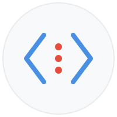

<p align="center">
<picture>
  <source media="(prefers-color-scheme: dark)" srcset=".github/images/logo-dark.svg">
  <source media="(prefers-color-scheme: light)" srcset=".github/images/logo.svg">
  
</picture>
</p>

<p align="center">

<br>
<a href="https://godoc.org/github.com/netascode/xmldot"></a>
<a href="https://goreportcard.com/report/github.com/netascode/xmldot"></a>
<a href="https://codecov.io/gh/netascode/xmldot"></a>
<a href="https://netascode.github.io/xmldot-playground/"></a>
</p>

<h3 align="center">get and set xml values with dot notation</h3>

XMLDOT is a Go package that provides a [fast](docs/performance.md) and [simple](#get-a-value) way to get and set values in XML documents. It has features such as [dot notation paths](#path-syntax), [wildcards](#wildcards), [filters](#filters), [modifiers](#modifiers), and [array operations](#working-with-arrays).

Inspired by [GJSON](https://github.com/tidwall/gjson) and [SJSON](https://github.com/tidwall/sjson) for JSON.

Getting Started
===============

## Installing

To start using XMLDOT, install Go and run `go get`:

```sh
$ go get -u github.com/netascode/xmldot
```

This will retrieve the library.

## Try It Online

**[🎮 Interactive Playground](https://netascode.github.io/xmldot-playground/)**

Experiment with XMLDOT in your browser without installing anything. The playground lets you:
- Test path queries against sample or custom XML
- Explore filters, wildcards, and modifiers
- See results in real-time
- Learn the syntax interactively

Perfect for learning or prototyping queries before using in code.

## Get a value

Get searches XML for the specified path. A path is in dot syntax, such as "book.title" or "book.@id". When the value is found it's returned immediately.

```go
package main

import "github.com/netascode/xmldot"

const xml = `
<catalog>
    <book id="1">
        <title>The Go Programming Language</title>
        <author>Alan Donovan</author>
        <price>44.99</price>
    </book>
</catalog>`

func main() {
    title := xmldot.Get(xml, "catalog.book.title")
    println(title.String())
}
```

This will print:

```
The Go Programming Language
```

## Fluent API (v0.2.0+)

The fluent API enables method chaining on Result objects for cleaner, more readable code:

```go
// Basic fluent chaining
root := xmldot.Get(xml, "root")
name := root.Get("user.name").String()
age := root.Get("user.age").Int()

// Deep chaining
fullPath := xmldot.Get(xml, "root").
    Get("company").
    Get("department").
    Get("team.member").
    Get("name").
    String()

// Batch queries
user := xmldot.Get(xml, "root.user")
results := user.GetMany("name", "age", "email")
name := results[0].String()
age := results[1].Int()
email := results[2].String()

// Case-insensitive queries
opts := &xmldot.Options{CaseSensitive: false}
name := root.GetWithOptions("USER.NAME", opts).String()
```

**Performance**: Fluent chaining adds ~280% overhead for 3-level chains compared to full paths. For performance-critical code, use direct paths:

```go
// Fast (recommended for hot paths)
name := xmldot.Get(xml, "root.user.name")

// Readable (recommended for business logic)
user := xmldot.Get(xml, "root.user")
name := user.Get("name")
```

**Array Handling**: Field extraction on arrays requires explicit `#.field` syntax:

```go
items := xmldot.Get(xml, "catalog.items")
// Extract all prices
prices := items.Get("item.#.price")  // Array of all prices
```

## Set a value

Set modifies an XML value for the specified path. A path is in dot syntax, such as "book.title" or "book.@id".

```go
package main

import "github.com/netascode/xmldot"

const xml = `
<catalog>
    <book id="1">
        <title>The Go Programming Language</title>
        <price>44.99</price>
    </book>
</catalog>`

func main() {
    value, _ := xmldot.Set(xml, "catalog.book.price", 39.99)
    println(value)
}
```

This will print:

```xml
<catalog><book id="1"><title>The Go Programming Language</title><price>39.99</price></book></catalog>
```

### Creating Elements with Attributes (v0.3.0+)

Starting from v0.3.0, Set automatically creates missing parent elements when setting attributes. This makes it easy to add attributes to elements that don't yet exist:

```go
xml := `<root></root>`

// Automatically creates <user> element with id attribute
result, _ := xmldot.Set(xml, "root.user.@id", "123")
// Result: <root><user id="123"></user></root>

// Works with deep paths too
result, _ = xmldot.Set(xml, "root.company.department.@name", "Engineering")
// Result: <root><company><department name="Engineering"></department></company></root>
```

Before v0.3.0, setting an attribute on a non-existent element would return an error. Now the element is automatically created.

## Path Syntax

A path is a series of keys separated by a dot. The dot character can be escaped with `\`.

```xml
<catalog>
    <book id="1">
        <title>The Go Programming Language</title>
        <author>Alan Donovan</author>
        <price>44.99</price>
        <tags>
            <tag>programming</tag>
            <tag>go</tag>
        </tags>
    </book>
    <book id="2">
        <title>Learning Go</title>
        <author>Jon Bodner</author>
        <price>39.99</price>
    </book>
</catalog>
```

```
catalog.book.title           >> "The Go Programming Language"
catalog.book.@id             >> "1"
catalog.book.price           >> "44.99"
catalog.book.1.title         >> "Learning Go"
catalog.book.#               >> 2
catalog.book.tags.tag.0      >> "programming"
catalog.book.title.%         >> "The Go Programming Language"
```

### Arrays

Array elements are accessed by index:

```
catalog.book.0.title         >> "The Go Programming Language" (first book)
catalog.book.1.title         >> "Learning Go" (second book)
catalog.book.#               >> 2 (count of books)
catalog.book.tags.tag.#      >> 2 (count of tags)
```

Append new elements using index `-1` with `Set()` or `SetRaw()`:

```go
xml := `<catalog><book><title>Book 1</title></book></catalog>`

// Append a new book using SetRaw for XML content
result, _ := xmldot.SetRaw(xml, "catalog.book.-1", "<title>Book 2</title>")
count := xmldot.Get(result, "catalog.book.#")
// count.Int() → 2

// Works with empty arrays too
xml2 := `<catalog></catalog>`
result2, _ := xmldot.SetRaw(xml2, "catalog.book.-1", "<title>First Book</title>")
// Result: <catalog><book><title>First Book</title></book></catalog>
```

### Attributes

Attributes are accessed with the `@` prefix:

```
catalog.book.@id             >> "1"
catalog.book.0.@id           >> "1"
catalog.book.1.@id           >> "2"
```

### Text Content

Text content (ignoring child elements) uses the `%` operator:

```
catalog.book.title.%         >> "The Go Programming Language"
```

## Wildcards

Single-level wildcards `*` match any element at that level. Recursive wildcards `**` match elements at any depth:

```xml
<catalog>
    <book id="1">
        <title>The Go Programming Language</title>
        <price>44.99</price>
    </book>
    <book id="2">
        <title>Learning Go</title>
        <price>39.99</price>
    </book>
</catalog>
```

```
catalog.*.title              >> ["The Go Programming Language", "Learning Go"]
catalog.book.*.%             >> ["The Go Programming Language", "Alan Donovan", "44.99", ...]
catalog.**.price             >> ["44.99", "39.99"] (all prices at any depth)
```

## Filters

You can filter elements using GJSON-style query syntax. Supports `==`, `!=`, `<`, `>`, `<=`, `>=`, `%`, `!%` operators:

```xml
<catalog>
    <book status="active">
        <title>The Go Programming Language</title>
        <price>44.99</price>
    </book>
    <book status="active">
        <title>Learning Go</title>
        <price>39.99</price>
    </book>
    <book status="discontinued">
        <title>Old Book</title>
        <price>19.99</price>
    </book>
</catalog>
```

```
catalog.book.#(price>40).title               >> "The Go Programming Language"
catalog.book.#(@status==active)#.title       >> ["The Go...", "Learning Go"]
catalog.book.#(price<30).#(@status==active)  >> [] (no matches)
catalog.book.#(title%"*Go*")#.title          >> ["The Go...", "Learning Go"] (pattern match)
```

## Modifiers

Modifiers transform query results using the `|` operator:

```
catalog.book.title|@reverse                  >> ["Learning Go", "The Go..."]
catalog.book.price|@sort                     >> ["39.99", "44.99"]
catalog.book.title|@first                    >> "The Go Programming Language"
catalog.book.title|@last                     >> "Learning Go"
catalog.book|@pretty                         >> formatted XML
```

### Built-in modifiers

- `@reverse`: Reverse array order
- `@sort`: Sort array elements
- `@first`: Get first element
- `@last`: Get last element
- `@keys`: Get element names
- `@values`: Get element values
- `@flatten`: Flatten nested arrays
- `@pretty`: Format XML with indentation
- `@ugly`: Remove all whitespace
- `@raw`: Get raw XML without parsing

### Custom modifiers

You can add your own modifiers:

```go
xmldot.AddModifier("uppercase", func(xml, arg string) string {
    return strings.ToUpper(xml)
})

result := xmldot.Get(xml, "catalog.book.title|@uppercase")
// "THE GO PROGRAMMING LANGUAGE"
```

## Working with Arrays

The `Result.Array()` function returns an array of values. The `ForEach` function allows iteration:

```go
result := xmldot.Get(xml, "catalog.book.title")
for _, title := range result.Array() {
    println(title.String())
}
```

Or use `ForEach`:

```go
xmldot.Get(xml, "catalog.book").ForEach(func(_, book xmldot.Result) bool {
    println(book.Get("title").String())
    return true // keep iterating
})
```

## Result Type

XMLDOT returns a `Result` type that holds the value and provides methods to access it:

```go
result.Type           // String, Number, True, False, Null, or XML
result.Str            // the string value
result.Num            // the float64 number
result.Raw            // the raw xml
result.Index          // index in original xml

result.String() string
result.Bool() bool
result.Int() int64
result.Float() float64
result.Array() []Result
result.Exists() bool
result.IsArray() bool
result.Value() interface{}
result.Get(path string) Result
result.GetMany(paths ...string) []Result
result.GetWithOptions(path string, opts *Options) Result
result.ForEach(iterator func(index int, value Result) bool)
```

## Namespaces

Basic namespace prefix matching is supported:

```xml
<root xmlns:ns="http://example.com">
    <ns:item>value</ns:item>
</root>
```

```
root.ns:item                 >> "value"
```

**Note**: Only prefix matching is supported. Namespace URIs are not resolved. For full namespace support, use `encoding/xml`.

## Validation

Validate XML before processing:

```go
if !xmldot.Valid(xml) {
    return errors.New("invalid xml")
}

// Or get detailed errors
if err := xmldot.ValidateWithError(xml); err != nil {
    fmt.Printf("Error at line %d, column %d: %s\n",
        err.Line, err.Column, err.Message)
}
```

## XML Fragments (Multiple Roots)

xmldot supports XML fragments with multiple root elements. Fragments with matching root names can be treated as arrays:

```go
fragment := `<user id="1"><name>Alice</name></user>
<user id="2"><name>Bob</name></user>
<user id="3"><name>Carol</name></user>`

// Validation accepts multiple roots
if xmldot.Valid(fragment) {
    fmt.Println("Fragment is valid")
}

// Query first matching root
name := xmldot.Get(fragment, "user.name")  // → "Alice"

// Array operations on matching roots
count := xmldot.Get(fragment, "user.#")           // → 3
first := xmldot.Get(fragment, "user.0.name")      // → "Alice"
names := xmldot.Get(fragment, "user.#.name")      // → ["Alice", "Bob", "Carol"]

// Modify first matching root
result, _ := xmldot.Set(fragment, "user.@status", "active")

// Build fragments incrementally using root-level append
xml := `<user>Alice</user>`
xml, _ = xmldot.Set(xml, "item.-1", "first")   // Creates sibling: <user>Alice</user><item>first</item>
xml, _ = xmldot.Set(xml, "item.-1", "second")  // Appends sibling: <user>Alice</user><item>first</item><item>second</item>
```

## Multiple Paths

Get multiple paths efficiently:

```go
results := xmldot.GetMany(xml, "catalog.book.0.title", "catalog.book.0.price")
println(results[0].String())  // title
println(results[1].Float())   // price
```

Set multiple paths:

```go
paths := []string{"catalog.book.0.price", "catalog.book.1.price"}
values := []interface{}{39.99, 34.99}
result, _ := xmldot.SetMany(xml, paths, values)
```

Delete multiple paths:

```go
result, _ := xmldot.DeleteMany(xml, "catalog.book.0.tags", "catalog.book.1.tags")
```

## Working with Bytes

If your XML is in a `[]byte` slice, use `GetBytes`:

```go
var xml []byte = ...
result := xmldot.GetBytes(xml, "catalog.book.title")
```

## Design Philosophy

**Zero External Dependencies**: XMLDOT uses only Go standard library for portability and security. All functionality including pattern matching uses internal implementations with built-in security protections.

## Concurrency

All read operations are thread-safe and can be used concurrently without synchronization:

```go
// Safe: concurrent reads
var wg sync.WaitGroup
for i := 0; i < 100; i++ {
    wg.Add(1)
    go func(id int) {
        defer wg.Done()
        result := xmldot.Get(xml, fmt.Sprintf("users.user.%d.name", id))
        process(result)
    }(i)
}
wg.Wait()
```

Write operations require external synchronization:

```go
var mu sync.Mutex
currentXML := "<root></root>"

func updateXML(path string, value interface{}) {
    mu.Lock()
    defer mu.Unlock()
    result, _ := xmldot.Set(currentXML, path, value)
    currentXML = result
}
```

See the [Concurrency Guide](docs/concurrency.md) for patterns and best practices.

## Documentation

### Guides

- [Path Syntax Reference](docs/path-syntax.md) - Complete path expression guide
- [Error Handling Guide](docs/error-handling.md) - Error types and patterns
- [Performance Guide](docs/performance.md) - Optimization techniques
- [Concurrency Guide](docs/concurrency.md) - Thread-safety patterns
- [Security Guide](docs/security.md) - Security features and limits
- [Migration Guide](docs/migration.md) - Moving from other libraries

### Examples

- [Basic Get Queries](examples/basic-get/) - Simple element access
- [Basic Set Operations](examples/basic-set/) - Modify XML documents
- [Array Manipulation](examples/arrays/) - Working with arrays
- [Query Filters](examples/filters/) - Filter elements by conditions
- [Result Modifiers](examples/modifiers/) - Transform query results
- [Custom Modifiers](examples/custom-modifiers/) - Build custom transformations
- [Namespace Support](examples/namespaces/) - Work with XML namespaces
- [Performance](examples/performance/) - Optimize for speed

### Real-World Examples

- [RSS Parser](examples/real-world/rss-parser/) - Parse RSS/Atom feeds
- [Config Files](examples/real-world/config-files/) - Manage XML config files
- [SOAP Client](examples/real-world/soap-client/) - Build SOAP clients

### API Documentation

Full API reference available at [GoDoc](https://godoc.org/github.com/netascode/xmldot).

## Contributing

We welcome contributions! Please see [CONTRIBUTING.md](CONTRIBUTING.md) for guidelines.

## License

This project is licensed under the MIT License - see the [LICENSE](LICENSE) file for details.

## Acknowledgments

Inspired by the excellent [gjson](https://github.com/tidwall/gjson) and [sjson](https://github.com/tidwall/sjson) libraries for JSON.
